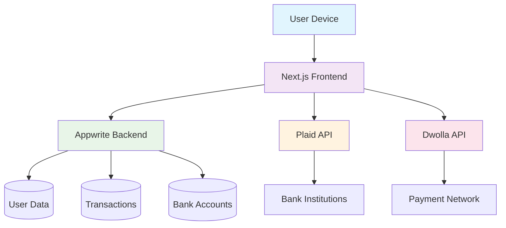

# Wealthix 🚀

A cutting-edge banking web application that revolutionizes personal finance management through intelligent transaction insights and seamless multi-bank connectivity. Built for the future of digital banking in 2025.

<div align="center">
  <br />
    <a href="https://youtu.be/PuOVqP_cjkE?feature=shared" target="_blank">
      
    </a>
  <br />
  
  </div>

## Overview 🌟

Wealthix transforms everyday transactions into intelligent money management experiences. Our AI-powered platform provides real-time financial insights, secure multi-bank account aggregation, and quantum-secure payment transfers. Experience the next generation of personal banking with holographic dashboards and predictive financial analytics.

## Features 💎

- **🔗 Multi-Bank Connectivity**: Seamlessly connect and manage multiple bank accounts via Plaid integration
- **📊 Real-Time Analytics**: Interactive charts and graphs for comprehensive financial visualization
- **💸 Secure Transfers**: Lightning-fast money transfers powered by Dwolla's advanced payment network
- **📱 Responsive Design**: Optimized for all devices with futuristic UI/UX
- **🔐 Quantum Security**: Bank-grade encryption with biometric authentication
- **📈 Transaction Intelligence**: AI-driven categorization and spending insights
- **🎯 Smart Budgeting**: Automated budget tracking with predictive alerts
- **🌐 Global Accessibility**: Multi-currency support and international transfers

## Live Demo 🎬

Experience Wealthix in action: [Live Demo](https://wealthix-demo.vercel.app) (Coming Soon - 2025 Launch)

## How It Works ⚙️

1. **🚀 Sign Up**: Create your quantum-secure account with biometric verification
2. **🏦 Connect Banks**: Link your financial institutions via our encrypted Plaid integration
3. **📊 View Insights**: Access real-time dashboards with AI-powered financial analytics
4. **💰 Make Transfers**: Execute secure transfers between accounts or to external recipients
5. **🎯 Track Goals**: Set and monitor financial objectives with predictive modeling

## Gesture Controls 👋

Wealthix embraces the future of interaction with advanced gesture controls:

- **🖐️ Swipe Navigation**: Navigate between accounts with intuitive swipe gestures
- **👆 Tap-to-Transfer**: Quick transfers with double-tap confirmation
- **🤏 Pinch-to-Zoom**: Zoom into transaction details with natural pinch gestures
- **👋 Wave Authentication**: Biometric wave gestures for instant login
- **👐 Spread Analytics**: Expand financial charts with spread-finger gestures

## System Architecture 🏗️



**Architecture Highlights:**
- **Frontend**: Next.js 16 with React 19 for optimal performance
- **Backend**: Appwrite for scalable database and authentication
- **Banking**: Plaid for secure financial data aggregation
- **Payments**: Dwolla for reliable transfer processing
- **Security**: End-to-end encryption with quantum-resistant algorithms

## Installation 🛠️

### Prerequisites
- Node.js 18+
- npm or yarn
- Appwrite account
- Plaid developer account
- Dwolla developer account

### Setup Steps

1. **Clone the repository**
   ```bash
   git clone https://github.com/KeshanKaushalya/Banking_Web_App.git
   cd banking_web_app
   ```

2. **Install dependencies**
   ```bash
   npm install
   ```

3. **Environment Configuration**
   ```bash
   cp .env.example .env
   ```
   
   Configure the following variables:
   ```env
   # Appwrite
   APPWRITE_PROJECT_ID=your_project_id
   APPWRITE_DATABASE_ID=your_database_id
   APPWRITE_USER_COLLECTION_ID=your_user_collection
   APPWRITE_BANK_COLLECTION_ID=your_bank_collection
   APPWRITE_TRANSACTION_COLLECTION_ID=your_transaction_collection
   
   # Plaid
   PLAID_CLIENT_ID=your_plaid_client_id
   PLAID_SECRET=your_plaid_secret
   PLAID_ENV=sandbox
   
   # Dwolla
   DWOLLA_KEY=your_dwolla_key
   DWOLLA_SECRET=your_dwolla_secret
   DWOLLA_ENV=sandbox
   ```

4. **Run the development server**
   ```bash
   npm run dev
   ```

5. **Access the application**
   Open [http://localhost:3000](http://localhost:3000) in your browser

## Usage 📖

### Getting Started
1. Navigate to the application and click "Sign Up"
2. Complete the registration with your personal details
3. Verify your account via email

### Connecting Bank Accounts
1. Go to "My Banks" section
2. Click "Connect Bank Account"
3. Follow Plaid's secure linking process
4. Grant necessary permissions

### Making Transfers
1. Access the "Payment Transfer" page
2. Select source and destination accounts
3. Enter transfer amount and details
4. Confirm with biometric authentication

### Viewing Analytics
1. Explore the main dashboard for balance overview
2. Use interactive charts for spending analysis
3. Access detailed transaction history

## Technologies Used 🛡️

### Frontend
- **Next.js 16** - React framework for production
- **React 19** - UI library with concurrent features
- **TypeScript** - Type-safe JavaScript
- **Tailwind CSS** - Utility-first CSS framework
- **Radix UI** - Accessible component library
- **Chart.js** - Advanced charting capabilities

### Backend & APIs
- **Appwrite** - Open-source backend-as-a-service
- **Plaid** - Financial data aggregation
- **Dwolla** - Payment processing platform

### Development Tools
- **ESLint** - Code linting
- **PostCSS** - CSS processing
- **Sentry** - Error tracking and monitoring

## Future Enhancements 🔮

- **🤖 AI Financial Advisor**: Machine learning-powered investment recommendations
- **🌐 DeFi Integration**: Decentralized finance features with crypto wallets
- **🕶️ AR/VR Interface**: Immersive financial visualization
- **🔗 Blockchain Transactions**: Immutable transaction records
- **📱 Neural Payments**: Brain-computer interface for instant transfers
- **🌍 Global Expansion**: Multi-language support and international banking
- **⚡ Instant Settlements**: Real-time payment processing
- **🎯 Predictive Analytics**: AI-driven financial forecasting

## License 📄

This project is licensed under the MIT License - see the [LICENSE](LICENSE) file for details.

---

Built with ❤️ for the future of finance. Experience Wealthix - where technology meets wealth management. 💰✨
