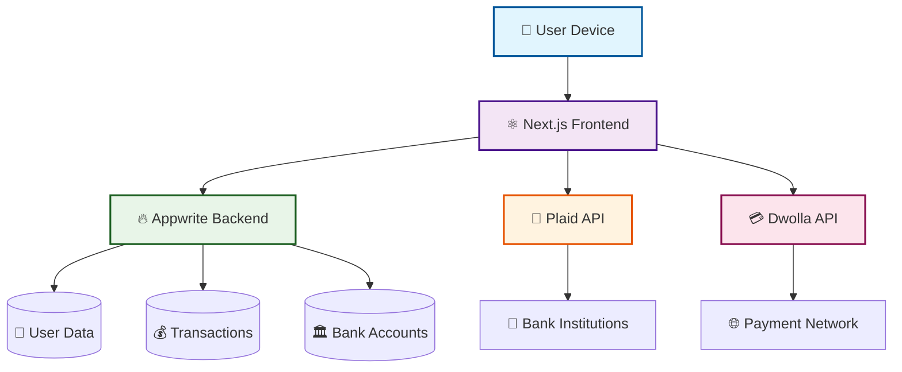
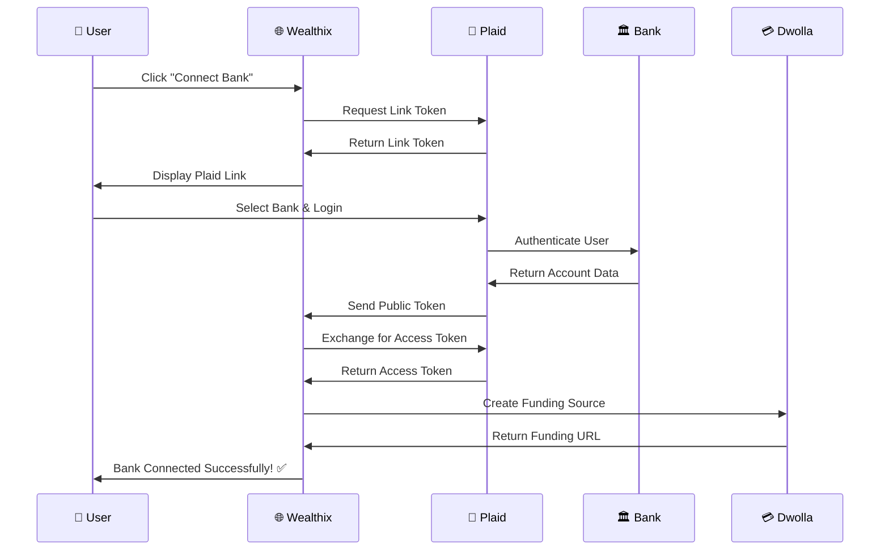
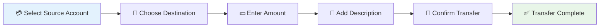

# Wealthix 🚀

[](https://nextjs.org/)
[](https://reactjs.org/)
[](https://www.typescriptlang.org/)
[](https://tailwindcss.com/)
[](https://appwrite.io/)
[](https://plaid.com/)
[](https://www.dwolla.com/)

<div align="center">
  
</div>

A cutting-edge banking web application that revolutionizes personal finance management through intelligent transaction insights and seamless multi-bank connectivity. Built for the future of digital banking in 2025.

<div align="center">
  <br />
    <a href="https://youtu.be/PuOVqP_cjkE?feature=shared" target="_blank">
      
    </a>
  <br />
  
  </div>


## Overview 🌟

Wealthix transforms everyday transactions into intelligent money management experiences. Our AI-powered platform provides real-time financial insights, secure multi-bank account aggregation, and quantum-secure payment transfers. Experience the next generation of personal banking with holographic dashboards and predictive financial analytics.

## ✨ Key Features

<table>
<tr>
<td width="50%">

### 🏦 Banking Features
- **🔗 Multi-Bank Connectivity** - Connect multiple accounts via Plaid
- **💸 Secure Transfers** - Lightning-fast transfers via Dwolla
- **📊 Real-Time Analytics** - Interactive financial dashboards
- **🔐 Quantum Security** - Bank-grade encryption

</td>
<td width="50%">

### 🤖 AI Features
- **📈 Transaction Intelligence** - AI-driven categorization
- **🎯 Smart Budgeting** - Automated budget tracking
- **🔮 Predictive Analytics** - Financial forecasting
- **🌐 Global Support** - Multi-currency transactions

</td>
</tr>
</table>

## 🎬 Live Demo

<div align="center">
  <a href="https://wealthixbanking-web-app.vercel.app/" target="_blank">
    
  </a>
</div>

## 🏗️ System Architecture



## 🛠️ Installation & Setup

### Prerequisites 📋

<div align="center">

| Technology | Version | Purpose |
|------------|---------|----------|
| 🟢 Node.js | 18+ | Runtime Environment |
| 📦 npm/yarn | Latest | Package Manager |
| 🔥 Appwrite | Account | Backend Services |
| 🏦 Plaid | Developer Account | Banking Integration |
| 💳 Dwolla | Developer Account | Payment Processing |

</div>

### 🚀 Quick Start Guide

#### Step 1: Clone Repository
```bash
# Clone the repository
git clone https://github.com/KeshanKaushalya/Banking_Web_App.git
cd banking_web_app

# Install dependencies
npm install
```

#### Step 2: Environment Setup
```bash
# Copy environment template
cp .env.example .env
```

#### Step 3: Configure Environment Variables
```env
# 🔥 Appwrite Configuration
NEXT_PUBLIC_APPWRITE_ENDPOINT=https://cloud.appwrite.io/v1
NEXT_PUBLIC_APPWRITE_PROJECT=your_project_id
APPWRITE_DATABASE_ID=your_database_id
APPWRITE_USER_COLLECTION_ID=your_user_collection
APPWRITE_BANK_COLLECTION_ID=your_bank_collection
APPWRITE_TRANSACTION_COLLECTION_ID=your_transaction_collection
NEXT_APPWRITE_KEY=your_api_key

# 🏦 Plaid Configuration
PLAID_CLIENT_ID=your_plaid_client_id
PLAID_SECRET=your_plaid_secret
PLAID_ENV=sandbox
PLAID_PRODUCTS=transactions,auth,identity
PLAID_COUNTRY_CODES=US,CA

# 💳 Dwolla Configuration
DWOLLA_KEY=your_dwolla_key
DWOLLA_SECRET=your_dwolla_secret
DWOLLA_BASE_URL=https://api-sandbox.dwolla.com
DWOLLA_ENV=sandbox
```

#### Step 4: Launch Application
```bash
# Start development server
npm run dev

# Open browser
# Navigate to http://localhost:3000
```

## 🏦 Bank Connection Setup Guide

### 🔐 Secure Bank Integration Process

<div align="center">
  
</div>

#### Step 1: Plaid Integration Setup

1. **Create Plaid Developer Account**
   ```bash
   # Visit: https://dashboard.plaid.com/signup
   # Complete registration and verification
   ```

2. **Configure Plaid Dashboard**
   - Navigate to **Team Settings** → **Keys**
   - Copy your `client_id` and `secret` (sandbox)
   - Add your domain to **Allowed Origins**
   - Enable required products: `transactions`, `auth`, `identity`

3. **Implement Bank Connection Flow**
   ```typescript
   // lib/plaid.ts - Plaid Client Configuration
   import { Configuration, PlaidApi, PlaidEnvironments } from 'plaid';
   
   const configuration = new Configuration({
     basePath: PlaidEnvironments.sandbox,
     baseOptions: {
       headers: {
         'PLAID-CLIENT-ID': process.env.PLAID_CLIENT_ID,
         'PLAID-SECRET': process.env.PLAID_SECRET,
       }
     }
   })
   
   export const plaidClient = new PlaidApi(configuration);
   ```

#### Step 2: Dwolla Payment Integration

1. **Setup Dwolla Sandbox**
   ```bash
   # Visit: https://developers.dwolla.com/
   # Create sandbox account
   # Generate API credentials
   ```

2. **Configure Payment Processing**
   ```typescript
   // lib/actions/dwolla.actions.ts
   import { Client } from 'dwolla-v2';
   
   const dwolla = new Client({
     key: process.env.DWOLLA_KEY!,
     secret: process.env.DWOLLA_SECRET!,
     environment: 'sandbox'
   });
   ```

#### Step 3: Bank Account Connection Workflow



### 🔄 Step-by-Step Bank Connection Process

#### For Users:

1. **🚀 Navigate to "My Banks"**
   - Click on the "My Banks" section in the sidebar
   - View your current connected accounts

2. **➕ Add New Bank Account**
   ```
   Click "Connect Bank Account" button
   ↓
   Plaid Link interface opens
   ↓
   Search and select your bank
   ↓
   Enter your online banking credentials
   Username: user_good
   Password: pass_good
   ↓
   Select accounts to connect
   ↓
   Grant permissions for data access
   ```

3. **✅ Verification Process**
   - Plaid securely verifies your credentials
   - Account information is encrypted and stored
   - Real-time balance and transaction sync begins

4. **🎯 Account Management**
   - View all connected accounts in dashboard
   - Monitor real-time balances
   - Access transaction history
   - Set up transfer capabilities

#### For Developers:

1. **🔧 Plaid Link Implementation**
   ```typescript
   // components/PlaidLink.tsx
   import { usePlaidLink } from 'react-plaid-link';
   
   const PlaidLink = ({ user, variant }: PlaidLinkProps) => {
     const { open, ready } = usePlaidLink({
       token: linkToken,
       onSuccess: (public_token, metadata) => {
         exchangePublicToken({
           publicToken: public_token,
           user,
         })
       },
       onExit: (err, metadata) => {
         console.log(err, metadata)
       },
     });
   
     return (
       <Button onClick={() => open()} disabled={!ready}>
         Connect Bank
       </Button>
     )
   }
   ```

2. **🔄 Token Exchange Process**
   ```typescript
   // lib/actions/user.actions.ts
   export const exchangePublicToken = async ({
     publicToken,
     user,
   }: exchangePublicTokenProps) => {
     try {
       // Exchange public token for access token
       const response = await plaidClient.itemPublicTokenExchange({
         public_token: publicToken,
       });
   
       const accessToken = response.data.access_token;
       const itemId = response.data.item_id;
   
       // Get account information
       const accountResponse = await plaidClient.accountsGet({
         access_token: accessToken,
       });
   
       // Create processor token for Dwolla
       const processorTokenResponse = await plaidClient.processorTokenCreate({
         access_token: accessToken,
         account_id: accountData.account_id,
         processor: "dwolla",
       });
   
       // Create funding source
       const fundingSourceUrl = await addFundingSource({
         dwollaCustomerId: user.dwollaCustomerId,
         processorToken: processorTokenResponse.data.processor_token,
         bankName: accountData.name,
       });
   
       // Save bank account to database
       await createBankAccount({
         userId: user.$id,
         bankId: itemId,
         accountId: accountData.account_id,
         accessToken,
         fundingSourceUrl,
         shareableId: encryptId(accountData.account_id),
       });
   
       return { publicTokenExchange: "complete" };
     } catch (error) {
       console.error("Token exchange error:", error);
     }
   }
   ```

## 📱 Usage Guide

### 🎯 Getting Started

<div align="center">

| Step | Action | Description |
|------|--------|-------------|
| 1️⃣ | **Sign Up** | Create secure account with email verification |
| 2️⃣ | **Connect Banks** | Link your financial institutions via Plaid |
| 3️⃣ | **View Dashboard** | Access real-time financial insights |
| 4️⃣ | **Make Transfers** | Send money securely between accounts |
| 5️⃣ | **Track Analytics** | Monitor spending patterns and budgets |

</div>

### 💰 Making Transfers



## 🛡️ Technology Stack

<div align="center">

### Frontend Technologies
| Technology | Version | Purpose |
|------------|---------|----------|
| ⚛️ **Next.js** | 16.1.0 | React Framework |
| ⚛️ **React** | 19.2.3 | UI Library |
| 📘 **TypeScript** | 5.9.3 | Type Safety |
| 🎨 **Tailwind CSS** | 3.4.19 | Styling |
| 🧩 **Radix UI** | Latest | Component Library |
| 📊 **Chart.js** | 4.5.1 | Data Visualization |

### Backend & APIs
| Service | Version | Purpose |
|---------|---------|----------|
| 🔥 **Appwrite** | 21.1.0 | Backend-as-a-Service |
| 🏦 **Plaid** | 40.0.0 | Banking Integration |
| 💳 **Dwolla** | 3.4.0 | Payment Processing |
| 🔐 **Sentry** | 10.32.1 | Error Monitoring |

</div>

## 🚀 Future Enhancements

<div align="center">

### 🔮 Roadmap 2025-2026

| Quarter | Feature | Status |
|---------|---------|--------|
| Q1 2025 | 🤖 AI Financial Advisor | 🔄 In Progress |
| Q2 2025 | 🌐 DeFi Integration | 📋 Planned |
| Q3 2025 | 🕶️ AR/VR Interface | 💡 Research |
| Q4 2025 | 🔗 Blockchain Transactions | 💡 Research |
| Q1 2026 | 📱 Neural Payments | 🔬 Experimental |
| Q2 2026 | 🌍 Global Expansion | 📋 Planned |

</div>

## 🤝 Contributing

<div align="center">
  
</div>

1. Fork the repository
2. Create your feature branch (`git checkout -b feature/AmazingFeature`)
3. Commit your changes (`git commit -m 'Add some AmazingFeature'`)
4. Push to the branch (`git push origin feature/AmazingFeature`)
5. Open a Pull Request

## 📄 License

<div align="center">
  
</div>

This project is licensed under the MIT License - see the [LICENSE](LICENSE) file for details.

---

<div align="center">
  
  
  <br />
  
  **⭐ Star this repository if you found it helpful!**
  
  <br />
  
  <a href="https://github.com/KeshanKaushalya/Banking_Web_App/stargazers">
    
  </a>
  <a href="https://github.com/KeshanKaushalya/Banking_Web_App/network/members">
    
  </a>
  <a href="https://github.com/KeshanKaushalya/Banking_Web_App/watchers">
    
  </a>
</div>

💰✨ **Wealthix - Revolutionizing Personal Finance Management** ✨💰
